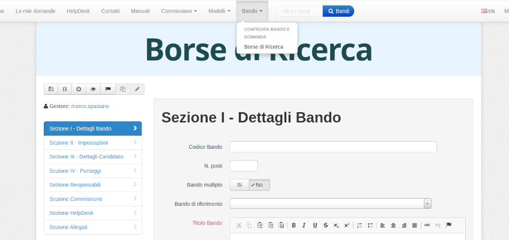

<!--s-->
## Selezioni on-line
Selezioni on-line permette di gestire l’iter concorsuale di un bando pubblico in tutte le sue fasi, partendo dalla redazione del bando di concorso alla sua pubblicazione, alla raccolta delle candidature e infine ai lavori della Commissione. Il sistema si basa su un repository documentale attraverso lo standard CMIS, su ECM Alfresco Community, ed è organizzato in cartelle e documenti corredate da metadati specifici e da permessi appositi.<!-- .element: class="text-justify" -->  

Il Bando di concorso è una cartella della base documentale, la quale contiene documenti (Bando di Concorso, Provvedimento di nomina della Commissione, Atti di Concorsi, ecc…) e cartelle che rappresentano le Candidature che a loro volta contegono documenti(Curriculum, Documento di Riconoscimento, Convocazioni, Comunicazioni, Esclusioni ecc.).<!-- .element: class="text-justify" --> 

<!--s-->
## UN PÒ DI NUMERI

Ad oggi la piattaforma ha gestito circa **2.600** bandi di cocorso tra Tempo determinato e indeterminato, PNRR, Direttori di Istituto ecc... ed ha
raccolto circa **90.000** domande e **1.600.000** documenti .<!-- .element: class="text-justify" -->

Nel tempo si è evoluta con nuove funzionalità e nel 2019 è stata pubblicata sul Catalogo Nazionale dei software **open source** gestito dal 
Dipartimento dell'innovazione della Presidenza del consiglio dei ministri, ad oggi è stata riutilizzata da **13** amministrazioni pubbliche
tra cui AGID, Accademia Nazionale dei Lincei, Istituto Superiore di Sanità, Consiglio regionale dell'Abruzzo ecc...<!-- .element: class="text-justify" --> 

<!--s-->
# ABILITAZIONI
## RUOLI

### Utente non registrato<!-- .element: class="fragment" data-fragment-index="0"-->
### Utente registrato<!-- .element: class="fragment" data-fragment-index="1"-->
### Commissario<!-- .element: class="fragment" data-fragment-index="2"-->
### Gestore<!-- .element: class="fragment"  data-fragment-index="3"-->
### Responsabile del procedimento<!-- .element: class="fragment" data-fragment-index="4"-->
### Gruppo Concorsi<!-- .element: class="fragment" data-fragment-index="5"-->
### Amministratore<!-- .element: class="fragment" data-fragment-index="6"-->

<!--s-->
## Configurazione del Bando
#### 

Se si dispone del ruolo di gestore assegnato alla tipologia **Borse di Ricerca** nel menù comparirà la voce che permette
la creazione di un nuovo bando, inoltre sarà possibile copiare la configurazione di un bando creato in precedenza.

<!--s-->

# Grazie!

marco.spasiano@cnr.it 

https://github.com/mspasiano 

[@spasia73](https://twitter.com/spasia73)
