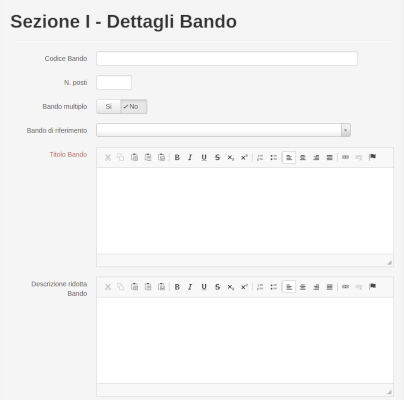
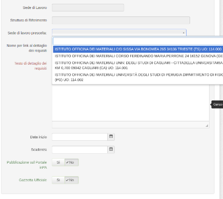
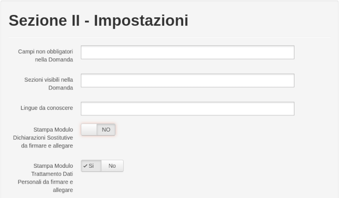
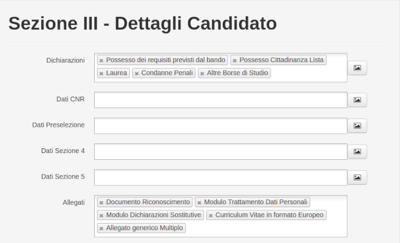
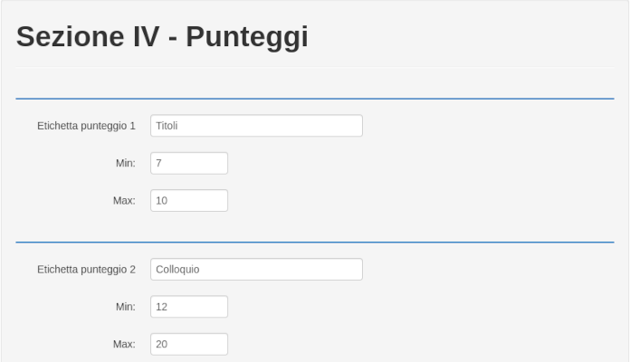
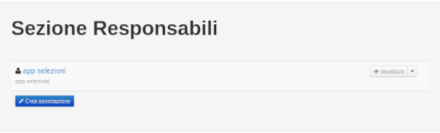
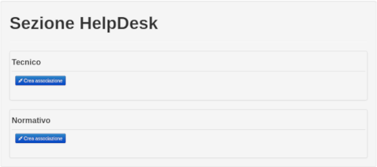
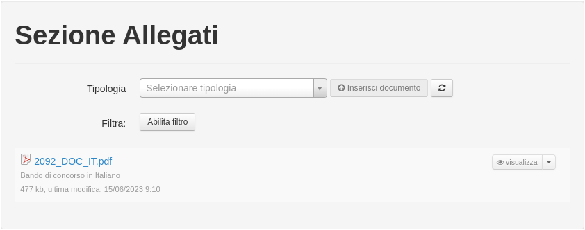
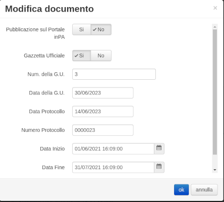

<!--s-->
## Selezioni on-line
Selezioni on-line permette di gestire l’iter concorsuale di un bando pubblico in tutte le sue fasi, partendo dalla redazione del bando di concorso alla sua pubblicazione, alla raccolta delle candidature e infine ai lavori della Commissione. Il sistema si basa su un repository documentale attraverso lo standard CMIS, su ECM Alfresco Community, ed è organizzato in cartelle e documenti corredate da metadati specifici e da permessi appositi.<!-- .element: class="text-justify" -->  

Il Bando di concorso è una cartella della base documentale, la quale contiene documenti (Bando di Concorso, Provvedimento di nomina della Commissione, Atti di Concorsi, ecc…) e cartelle che rappresentano le Candidature che a loro volta contegono documenti(Curriculum, Documento di Riconoscimento, Convocazioni, Comunicazioni, Esclusioni ecc.).<!-- .element: class="text-justify" --> 

<!--s-->
## UN PÒ DI NUMERI

Ad oggi la piattaforma ha gestito circa **2.600** bandi di concorso tra Tempo determinato e indeterminato, PNRR, Direttori di Istituto ecc... ed ha
raccolto circa **90.000** domande e quasi **2 Milioni** di documenti.<!-- .element: class="text-justify" -->

Nel tempo si è evoluta con nuove funzionalità e nel 2019 è stata pubblicata sul Catalogo Nazionale dei software **open source** gestito dal 
Dipartimento dell'innovazione della Presidenza del consiglio dei ministri, ad oggi è stata riutilizzata da **13** amministrazioni pubbliche
tra cui:
- AGenzia per l'Italia Digitale<!-- .element: class="fragment" data-fragment-index="0"-->
- Accademia Nazionale dei Lincei<!-- .element: class="fragment" data-fragment-index="1"-->
- Istituto Superiore di Sanità<!-- .element: class="fragment" data-fragment-index="2"-->
- Consiglio regionale dell'Abruzzo<!-- .element: class="fragment" data-fragment-index="3"-->

<!--s-->
# ABILITAZIONI
## RUOLI

### Utente non registrato<!-- .element: class="fragment" data-fragment-index="0"-->
### Utente registrato<!-- .element: class="fragment" data-fragment-index="1"-->
### Commissario<!-- .element: class="fragment" data-fragment-index="2"-->
### Gestore<!-- .element: class="fragment"  data-fragment-index="3"-->
### Responsabile del procedimento<!-- .element: class="fragment" data-fragment-index="4"-->
### Gruppo Concorsi<!-- .element: class="fragment" data-fragment-index="5"-->
### Amministratore<!-- .element: class="fragment" data-fragment-index="6"-->

<!--s-->
## Configurazione del Bando

Se si dispone del ruolo di gestore assegnato alla tipologia **Borse di Ricerca** nel menù comparirà la voce che permette la creazione di un nuovo bando, inoltre sarà possibile copiare la configurazione di un bando creato in precedenza, modificando le informazioni eventualmente differenti.<!-- .element: class="text-justify" --> 

<!--v-->
## Sezione I - Dettagli Bando
 

In questa sezione si inseriscono i dati obbligatori del Bando, ad esempo non è possibile procedere al salvataggio senza aver indicato il codice.
Inoltre sono presenti le informazioni quali la descrizione e i requisiti che possono essere compilati anche in lingua Inglese.  

<!--v-->
## Sezione II - Impostazioni

In questa sezione si decide, se rendere opzionali alcuni campi della domanda e quali sezioni della stessa siano visualizzate, tipicamente: **Dati Anagrafici, Dati Residenza, Reperibilità, Dichiarazioni, Allegati vari**, inoltre se rendere obbligatoria la stampa e l'inserimento del Modulo Dichiarazioni Sostitutive (l'allegato va richiesto nella sezione 3) o del Trattamento Dati Personali. 

<!--v-->
## Sezione III - Dettagli Candidato

Questa sezione permette di scegliere le dichiarazioni che il candidato deve compilare e gli allegati che deve inserire. Entrambi i campi sono a compilazione assistita e consentono una rapida selezione degli elementi. E' possibile visualizzare l'anteprima immediata delle dichiarazioni cliccando il tasto a destra del campo.

<!--v-->
## Sezione IV - Punteggi

La sezione permette di scegliere quante prove vengono effettuate e quali sono i punteggi minimi e massimi. 
Una volta stabilite le prove, queste saranno visibili nella pagina **Punteggi** presente nel menu del Bando.

<!--v-->
## Sezione Responsabili e Helpdesk
 

Dopo il primo salvataggio del Bando, sarà possibile selezionare uno o più responsabili del Bando, 
i quali avranno accesso completo al bando e potranno nominare la Commissione d'esame, sarà possibile indicare uno o più utenti 
per la gestione delle segnalazioni, sia per l'ambito tecnico sia per quello normativo. 
Gli utenti selezionati, se non sono già presenti in OIL vengono iscritti automaticamente, in questo caso la password di default per accedere la prima volta al portale OIL è _cambiala_.

<!--v-->
## Sezione Allegati

La sezione degli allegati comprende l'inserimento un gran numero di possibili documenti, ognuno dei quali corredato di specifici dati di contesto, in alcuni casi obbligatori, come numero e data di protocollazione, ai fini della pubblicazione è obbligatorio l'inserimento del Bando di Concorso in italiano.<!-- .element: class="text-min" -->

La sezione è gestibile in ogni fase del ciclo di vita del Bando. Ad esempio è possibile inserire la tipologia "Atti Concorsuali" dove caricare eventuali documenti oggetto di una richiesta di accesso atti ex art. 241/90. Una volta inserito il documento, è possibile impostare l'accesso privato ed assegnare i permessi al soggetto che ha presentato l'istanza (oppure al legale che lo rappresenta).<!-- .element: class="text-min" --> 

Anche in questo caso è sufficiente che il soggetto abbia effettuato un login con SPID almeno una volta.<!-- .element: class="text-min" -->

<!--s-->

## Proroga di una Borsa di Ricerca
Successivamente alla pubblicazione di un bando non è più possibile modificare le seguenti informazioni, Data inizio, Scadenza, Num. della G.U., Data della G.U., per cui se bisogna variare alcuni dati è possibile rimuovere la pubblicazione solo se non sono ancora pervenute candidature, viceversa bisogna allegare un documento di modifica e/o rettifica con proroga dei termini del bando. 

<!--s-->

# Grazie!

marco.spasiano@cnr.it 

https://github.com/mspasiano 

[@spasia73](https://twitter.com/spasia73)

[Questa presentazione in pdf](https://mspasiano.github.io/borse-ricerca-2023/slides.pdf)

[Manuale Selezioni on-line](https://consiglionazionaledellericerche.github.io/cool-jconon)